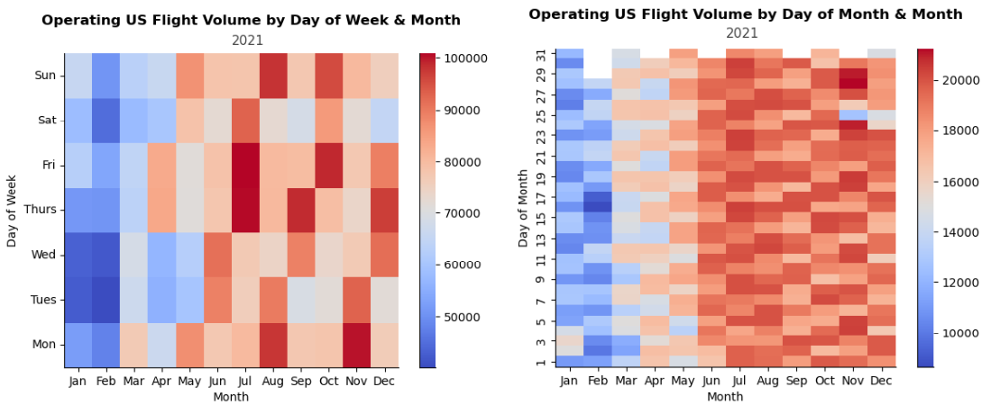

# DATASCI 200: Intro to Data Science Programming
## UC Berkeley School for Information
## Final Project 

This repository contains the collaborative project work of Aashray Puri, Isaac Madera, and Raymond Hung. , centered on comprehending domestic flight patterns within the US airline industry. Enclosed within are assorted Jupyter notebooks, datasets, code implementations, and documentation reflecting our combined exploration of various visualization techniques, methodologies, and the extraction of insightful conclusions.

### US Domestic Air Travel Trends & Data Analysis
The document offers a comprehensive exploration of US domestic air travel data through extensive exploratory data analysis (EDA), focusing on flight trends, cancellations, delays, and weather patterns. It begins by discussing the datasets used, including data pre-processing and cleanup procedures. The analysis covers trends over time, flight volume, popular and least popular airports and airlines, and the impact of weather conditions on flight operations.

### Project Contents

- The [notebooks](/notebooks/) directory contains all the Jupyter notebooks used during the project, including those for data exploration.

- Our [final project write-up](/Project_2_Puri_Madera_Hung_Final_Report.pdf/) provides a comprehensive overview of our research, methodologies, findings, and conclusions. 

- The core datasets utilized are sourced from [Kaggle](https://www.kaggle.com/datasets/robikscube/flight-delay-dataset-20182022?resource=download&select=Combined_Flights_2022.csv), with the original data provided by the US Department of Transportation (USDOT). These datasets cover US domestic flight data from January 2018 to July 2022. The study concentrates on Kaggle's datasets from 2019 to 2021 due to inconsistencies in the datasets for 2018 and 2022. Additionally, three supplementary datasets are incorporated: airline name data for code adjustments, airport geographical information for mapping purposes, and weather data for the top 10 airports with the highest number of flight departures in 2021 to analyze the impact of weather on domestic US air travel.
